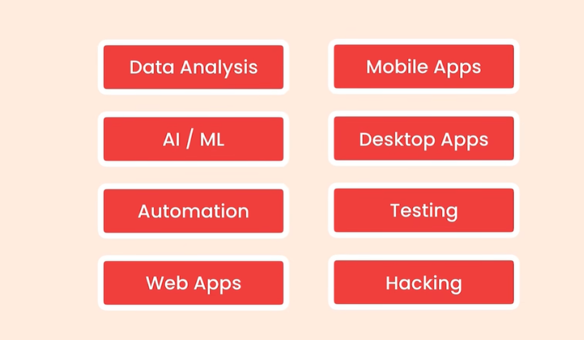

# 一、Python

自己学习编程感觉实在没什么天赋，听说Python比较简单而且容易上手，所以准备学习一下。之前学习计算机导论的时候也了解过一些，试试看自己能不能学会，加油吧，用老师的话来讲就是先学着，学得多了自然应用范围就广起来了。

## 1、入门

优势:

- 更少的代码就可以解决相对复杂的问题
- 用途很广
  - 

- High-level
- Cross-platform（跨平台）
- 庞大的社区
- 丰富的库

### 1. Python版本

- Python 2--2020
- Python 3--FUTURE

### 2. 下载并安装Python

- 访问Python官网
- 下载Python解释器
- 安装好之后输入Python可以看到如下界面
  - 

### 3. 开发工具

- IDE(集成开发环境)
  - PyCharm
- Editor
  - Vscode
  - Atom
  - Sublime

### 4. Python代码执行(Implementation)


## 2、基本类型

### 1. 变量

```python
price = 10 
rating = 4.9 
course_name = 'Python for Beginners' 
is_published = True
```

### 2. 注释

我们使用注释来在代码中添加注释。好的评论解释了方法和原因，而不是代码做什么。这应该反映在代码本身中。使用注释向自己或其他开发人员添加提醒，或者解释您的假设和以某种方式编写代码的原因。

```python
# This is a comment and it won't get executed.
# Our comments can be multiple lines.
```

### 3. 输入

```python
birth_year = int(input('Birth year: '))
```

**input()**  函数总是返回一个字符串，我们可以通过内置函数将其转换为一个整数

### 4. 字符串

使用单引号 (' ') 或者双引号(" ")来定义字符串。

如果定义一个多行字符串，我们可以使用三引号**tripe quotes (""")**

```python
course = "Python for Beginners"
course[0]  # returns the first character
course[1]  # returns the second character
course[-1]  # returns the first character from the end
course[-2]  # returns the second character from the end
message = """

醉后不知天在水
满船清梦压星河

"""
```

### 5. 分割字符串(切片)

```python
course[1:5]
```

### 6. 字符串格式化

```python
name = "Zesheng"
message = f"Hi,my name is {name}"
```

### 7. 字符串方法

```python
message = f"Hi,my name is {name}"

message.upper()  # to convert to uppercase
message.lower()  # to convert to lowercase
message.title()  # to capitalize the first letter of every word
message.find("p")  # returns the index of the first occurrence of p (or -1 if not found)
message.replace("p","q")
```

### 8. 成员运算符

```python
contains = 'Python' in course
```

### 9. 数学运算符

```python
+
-
*
/ # returns a float
// # returns an int
% # returns the remainder of division
** # exponentiation - x ** y = x to the power of y
```

### 10. 增强分配运算符(Augmented assignment operator)

```python
x = x + 10
x += 10
```

## 3、控制流(Control Flow)

### 1. if语句

```python
if is_hot:
	print("hot day")
elif is_cold:
 	print("cold day")
else: 
 	print("beautiful day")
```

### 2. 逻辑运算符

```python
if has_high_income and has_good_credit: 
	...
if has_high_income or has_good_credit: 
 	...
is_day = True
is_night = not is_day
```

### 3. 比较运算

```python
a > b
a >= b (greater than or equal to)
a < b
a <= b
a == b (equals)
a != b (not equals)
```

### 4. while循环

```python
i = 1
while i < 5:
    print(i)
    i += 1
```

### 5. for循环

```python
for i in range(1,5): 
 print(i)
```

• **range(5):** generates 0,1,2,3,4 

• **range(1,5):** generates 1,2,3,4 

• **range(1,5,2):** generates 1,3 

## 4、函数(Functions)

我们使用函数将代码分解成小块。这些数据块更容易阅读、理解和维护。如果存在bug，那么在一小块程序中找到bug比在整个程序中更容易。我们也可以重用这些块。

```python
def greet_user(name): 
	print(f"Hi {name}") 
greet_user("John")
```

形式参数(**Parameters**)是我们可以传递给函数的数据的占位符。实际参数(**Arguments**)是我们传递的实际值。

- 位置参数：他们的位置（顺序）很重要
- 关键字参数：位置不重要，我们在参数名称前面加上前缀。

```python
# Two positional arguments
greet_user("John","Smith")
# Keyword arguments
calculate_total(order=50,shipping=5,tax=0.1)
```

我们的函数可以返回值。如果我们不使用返回语句，默认情况下将返回None。没有是表示没有值的对象。

```python
def square(number): 
	return number * number 

result = square(2)
print(result) # prints 4
```

## 5、数据结构(Data Structures)

### 1. 列表(List)

```python
numbers = [1,2,3,4,5]
numbers[0] # returns the first item 
numbers[1] # returns the second item
numbers[-1] # returns the first item from the end
numbers[-2] # returns the second item from the end 
numbers.append(6) # adds 6 to the end
numbers.insert(0,6) # adds 6 at index position of 0
numbers.remove(6) # removes 6
numbers.pop() # removes the last item
numbers.clear() # removes all the items
numbers.index(8) # returns the index of first occurrence of 8
numbers.sort() # sorts the list
numbers.reverse() # reverses the list
numbers.copy() # returns a copy of the list
```

#### 1. 1 列表解包

```python
numbers = [1,2,3,4,5]
first,second,*other = numbers
```

#### 1. 2 遍历列表

```python
letters = ["a","b","c"]
for letter in letters:
    print(letter)
```

#### 1. 3 枚举Enumerate

```python
letters = ["a","b","c"]
for letter in enumerate(letters):
    print(letter)
'''
(0,'a')
(1,'b')
(2,'c')
'''
```

#### 1. 4 重复列表中元素

```python
zeros = [0] * 100
print(zeros)
```

#### 1. 5 列表排序

```python
numbers = [3,51,2,8,6]
numbers.sort(reverse=True)
print(sorted(numbers,reverse=True))

# 复杂排序
items = [
    ("Product1",10),
    ("Product2",9),
    ("Product3",2)
]

def sort_item(item):
    return item[1]
 

# items.sort(key = sort_item)
items.sort(key = lambda item:item[1])
print(items)
```

#### 1. 6 map函数

```python
items = [("Product1",10),("Product2",9),("Product3",2)]

prices = []
for item in items:
    prices.append(item[1])
print(prices)

x = list(map(lambda item: item[1],items))
print(x)

```

#### 1. 7 filter函数

```python
items = [("Product1",10),("Product2",9),("Product3",12)]


x = list(filter(lambda item: item[1] >= 10,items))
print(x)
```

#### 1. 8 列表推导式

```python
[expression for item in items]
```

#### 1. 9 zip 函数

```python
list1 = [1,2,3]
list2 = [10,20,30]

for i in zip(list1,list2):
    print(i)
```

#### 1. 10 栈 (Stacks)

- LIFO

#### 1. 11 队列(Queue)

- FIFO

```python
from collections import deque

queue = deque([])
queue.append(1)
queue.append(2)
queue.append(3)
queue.popleft()
print(queue)
if not queue:
    print("empty")
```

### 2. 元组(Tuples)

它们就像只读列表一样。我们用它们来存储一个项目列表。但是一旦我们定义了一个元组，我们就不能添加或删除项或更改现有的项。

```python
coordinates = (1,2,3)
x,y,z = coordinates
```

#### 2. 1 元素交换

```python
x = 10
y = 11

x,y = y,x
```

### 3. 字典(Dictionaries)

```python
customer = {
    "name": "John Smith",
    "age": 30,
    "is_verified": True
}
point = dict(x=1,y=2)
```

我们可以使用字符串或数字来定义键。它们应该是独特的。我们可以使用任何类型的值。

```python
customer["name"] # returns "John Smith"
customer["type"] # throws an error 
customer.get("type","silver") # returns "silver"
customer["name"] = "new name"
```

#### 1. 字典遍历

```python
for key,value in point.items():
    print(key,value)
```

#### 2. 字典推导式

```python
values = []
for x in range(5):
    values.append(x*2)
[x*2 for x in range(5)]


values = {x:x*2 for x in range(5)}
print(values)
```

### 4.数组(Array)

```python
from array import array

numbers = array("i",[1,2,3])
print(numbers[0])
```

### 5. 集合(Set)

```python
numbers = [1,1,2,3,4]
uniques = set(numbers)
second = {1,4}
second.add(5)
second.remove(4)
print(second)
print(uniques)

print(uniques | second)  # 并集
print(uniques & second)  # 交集
print(uniques - second)  # 差集
print(uniques ^ second)  # 对称差集

uniques.update([4,9])  # 更新集合
print(uniques)

uniques.clear()  # 清空集合

# 判断两个集合是否相交
print(s1.isdisjoint(s3))  # 输出：False
# 判断一个集合是否为另一个集合的子集
print(s3.issubset(s1))  # 输出：True
# 判断一个集合是否为另一个集合的超集
print(s1.issuperset(s3))  # 输出：True
```

### 6. 生成器(Generator)

```python
from sys import getsizeof

values_list = [x * 2 for x in range(1000)]
values = (x * 2 for x in range(1000))
print(getsizeof(values))
print(getsizeof(values_list))
```

### 7. unpacking operator

```python
values = list(range(5))
values = [*range(5)]


first = {"x": 1}
second = {"x": 10,"y": 2}
combined = {**first,**second,"z": 1}
print(combined)
```

#### 8. 统计词频

```python
from pprint import pprint

sentence = "This is a common interview"
char_sequency = {}
for char in sentence:
    if char in char_sequency:
        char_sequency[char] += 1
    else:
        char_sequency[char] = 1
pprint(char_sequency)
print(sorted(char_sequency.items(),key=lambda kv: kv[1],reverse=True))

```

## 6、异常(Exceptions)

### 1. 异常

异常情况是会导致我们的程序崩溃的错误。它们经常因为错误的输入或编程错误而发生。我们的工作是预测和处理这些异常情况，以防止我们的项目崩溃。

```python
try: 
    age = int(input('Age: '))
    income = 20000
    risk = income / age 
 	print(age)
except ValueError:
 	print('Not a valid number')
except ZeroDivisionError:
 	print('Age cannot be 0')
```

## 7、类(Classes)

### 1. 类

```python
class Point: 
    def __init__(self,x,y): 
        self.x = x
        self.y = y 
 	def move(self): 
 		print("move")
```

当一个函数是一个类的一部分时，我们将它称为一个方法。类定义了用于创建对象的模板或蓝图。一个对象是一个类的实例。每次我们创建一个新实例时，该实例都会遵循我们使用该类定义的结构。

```python
point1 = Point(10,5)
point2 = Point(2,4)
```

__init__是一种被称为构造函数的特殊方法。它在创建新对象时被调用。我们使用它来初始化我们的对象。

### 2. 继承(**Inheritance**)

继承是一种删除代码重复的技术。我们可以创建一个基类来定义公共方法，然后让其他类继承这些方法。

```python
class Mammal: 
    def walk(self): 
        print("walk")
class Dog(Mammal): 
    def bark(self): 
        print("bark")
        
dog = Dog()
dog.walk() # inherited from Mammal
dog.bark() # defined in Dog
```

## 8、模块(Modules)

### 1. 模块(Modules)

模块是一个带有一些Python代码的文件。我们使用模块将程序分解成多个文件。这样，我们的代码将会更好地组织起来。我们不会有一个巨大的文件中有一百万行代码！有两种导入模块的方法：我们可以导入整个模块，或导入一个模块中的特定对象。

```python
# importing the entire converters module
import converters
converters.kg_to_lbs(5)
# importing one function in the converters module
from converters import kg_to_lbs
kg_to_lbs(5)
```

### 2. 包(Packages)

程序包是一个包含\_\_init\_\_.py的目录。它可以包含一个或多个模块。

```python
# importing the entire sales module 
from ecommerce import sales
sales.calc_shipping()
# importing one function in the sales module
from ecommerce.sales import calc_shipping
calc_shipping()
```


